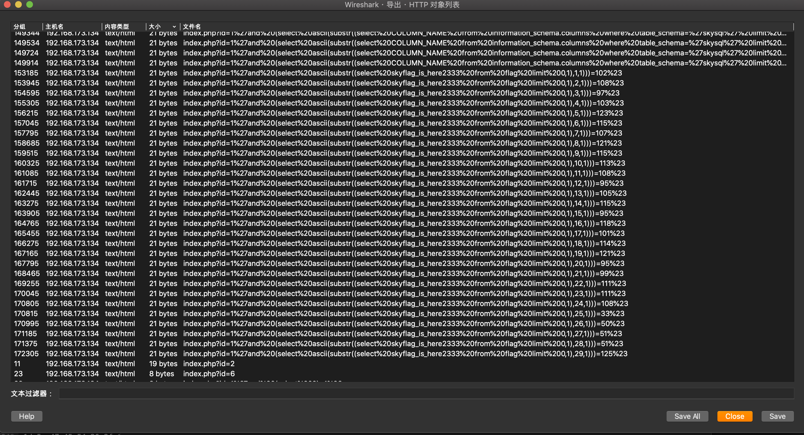
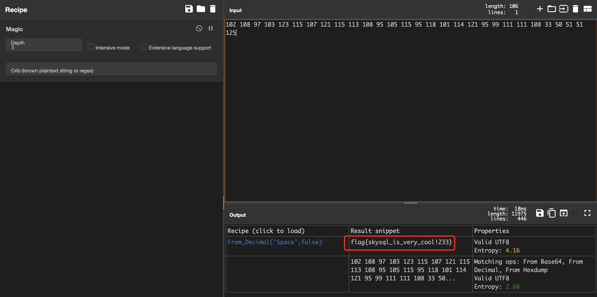

> 查看统计HTTP信息发现是进行SQL盲注，浏览下注入的语句，发现已经成功注入，找到注入成功的语句(按照数据包大小即可过滤成功的语句)

> 因为这是布尔盲注，采用二分法进行探测，需要提取成功的ascii码

102 108 97 103 123 115 107 121 115 113 108 95 105 115 95 118 101 114 121 95 99 111 111 108 33 50 51 51 125

> 将ASCII码转换为字符即可得到flag：

> flag{skysql_is_very_cool!233}