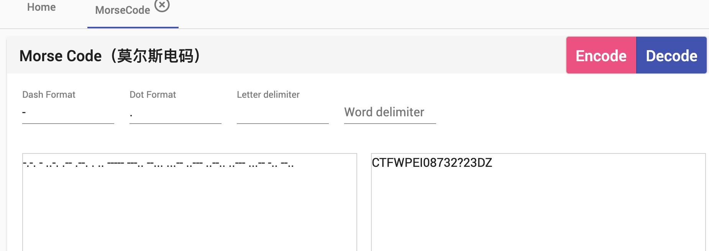

> 解压得到music.zip和pic.jpg图片，其中zip压缩包为真加密，查看图片下方发现盲文，使用盲文对照表翻译为明文为：KMDONOWG => kmdonowg

> 使用此密码解压zip压缩包得到音频文件，使用音频分析工具打开此音频，从波形图可看到宽度不一致且有固定间隔，此为莫斯密码

> -.-. - ..-. .-- .--. . .. ----- ---.. --... ...-- ..--- ..--.. ..--- ...-- -.. --..

> CTFWPEI08732?23DZ