> 解压1.zip提示需要密码（linux、macos可直接打开伪加密的包），修改全局标识加密位解压得到一个word文档和flag.zip压缩包

> 查看flag.zip压缩包为真加密，里面有flag.png和last words.txt两个文件；根据last words.txt文件名提示

> 查看Word内容，发现有一段记得的内容明显为空白，猜测为Word内容隐藏文字

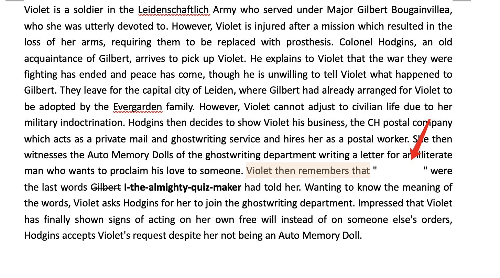

> 配置Word，勾选显示隐藏文字，得到隐藏内容：

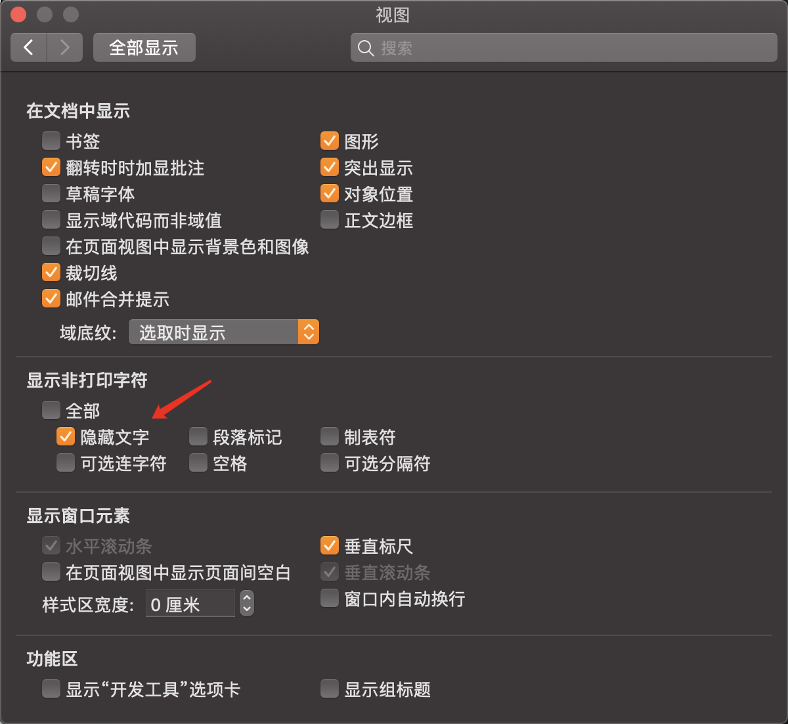

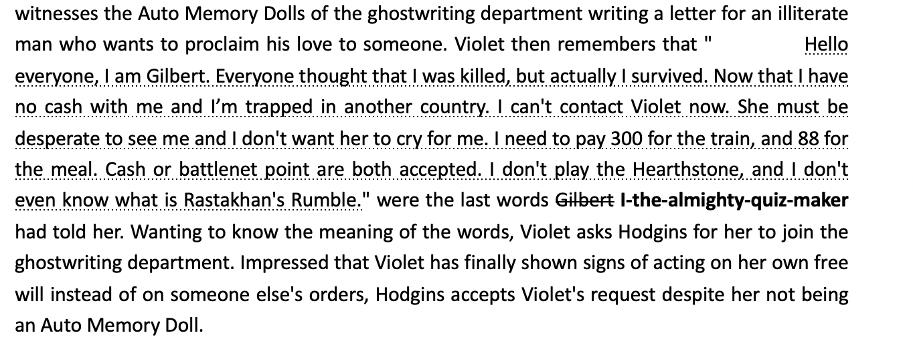

> 很明显隐藏文字应该就是last words.txt的内容，那应该就是明文攻击了；提取隐藏文字放入txt文本中

> 这里隐藏文字不可直接复制，可解压word文件，从xml里提取隐藏文字

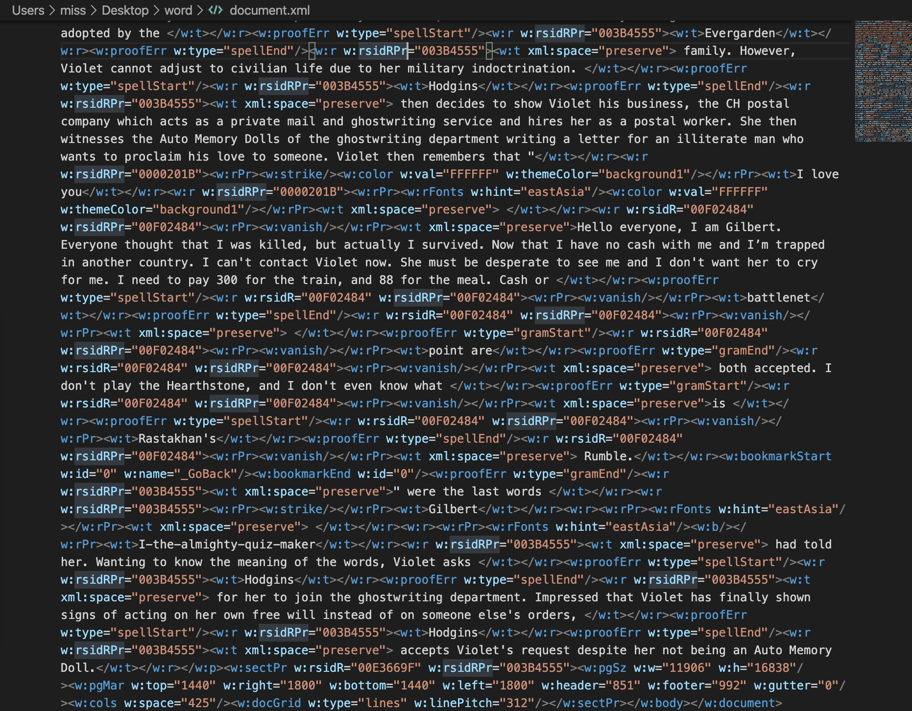

> 使用正则去掉标签，得到隐藏文字保存到txt文档中。

```
Hello everyone, I am Gilbert. Everyone thought that I was killed, but actually I survived. Now that I have no cash with me and I’m trapped in another country. I can't contact Violet now. She must be desperate to see me and I don't want her to cry for me. I need to pay 300 for the train, and 88 for the meal. Cash or battlenet point are both accepted. I don't play the Hearthstone, and I don't even know what is Rastakhan's Rumble.
```

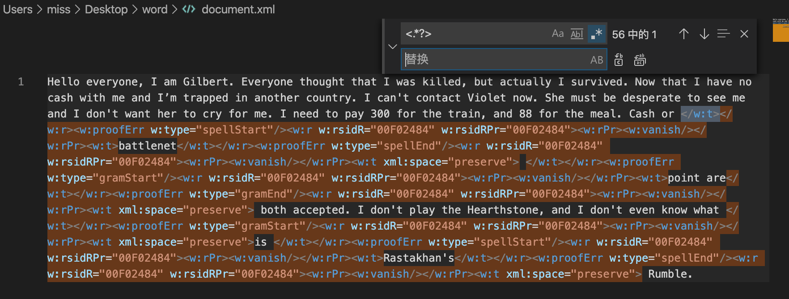

> 查看txt文档大小和flag.zip压缩包中的txt文档大小，发现多一个字节，为433字节

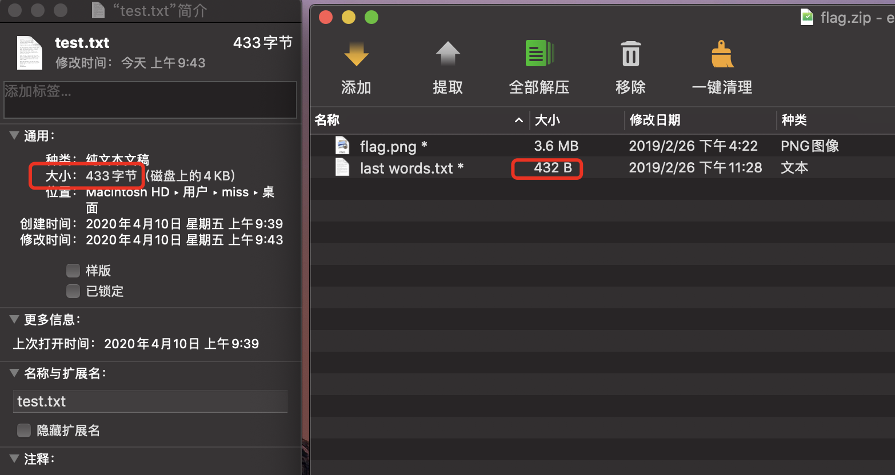

> 当前文本字数有431个，而大小却是433字节，说明这句话里有非ASCII码字符，仔细查看发现为I’m这个符号,所以utf-8编码中用3字节表示这个

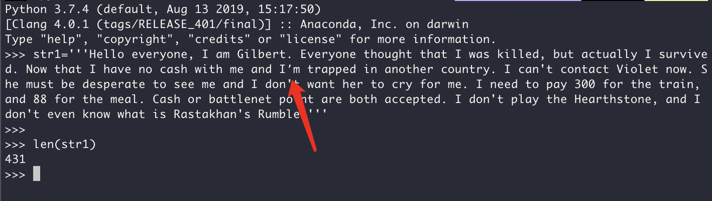

> 根据提示，将当前文本文档存储为GBK编码，发现大小为432字节，和压缩包中一致。

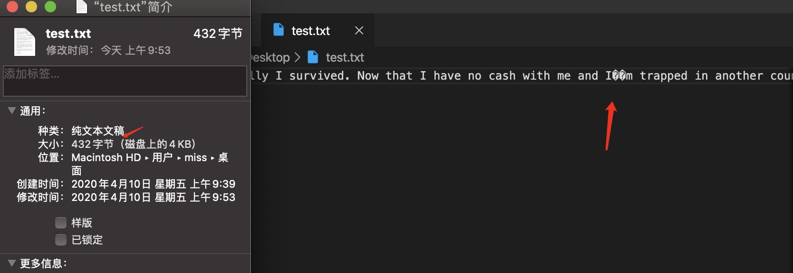

> 现在将文本文档进行压缩，自己先默认压缩一个明文压缩包，尝试明文攻击没有成功，猜测压缩方法不一样，查看flag.zip压缩包，发现注释说明e是采用winrar 5.70 beta2压缩软件、低压缩率、标志压缩方式进行压缩的

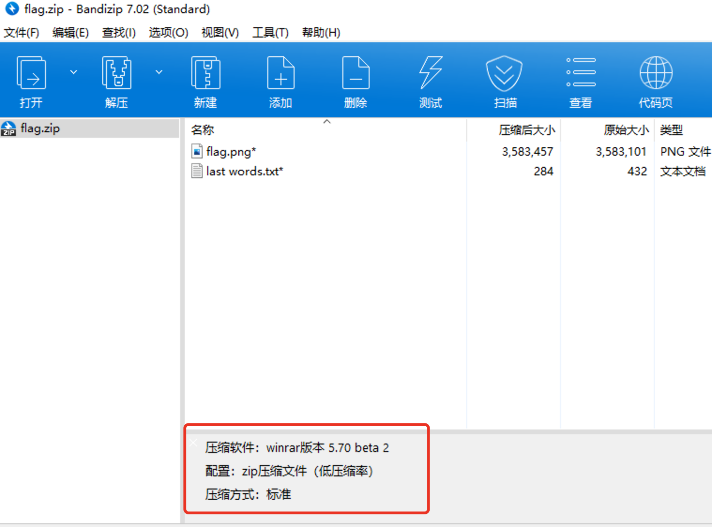

> 下载同版本的winrar压缩文本文档，进行明文攻击，成功破解秘钥

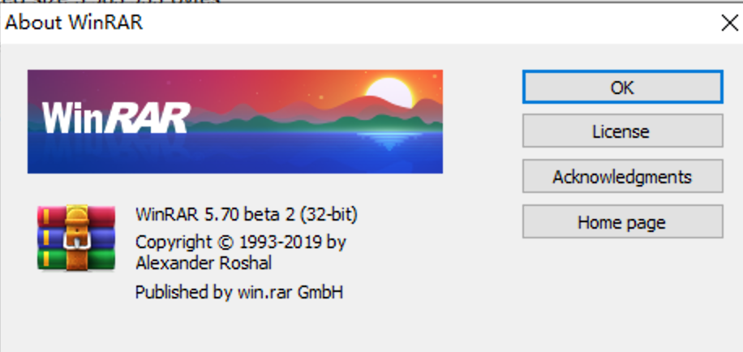

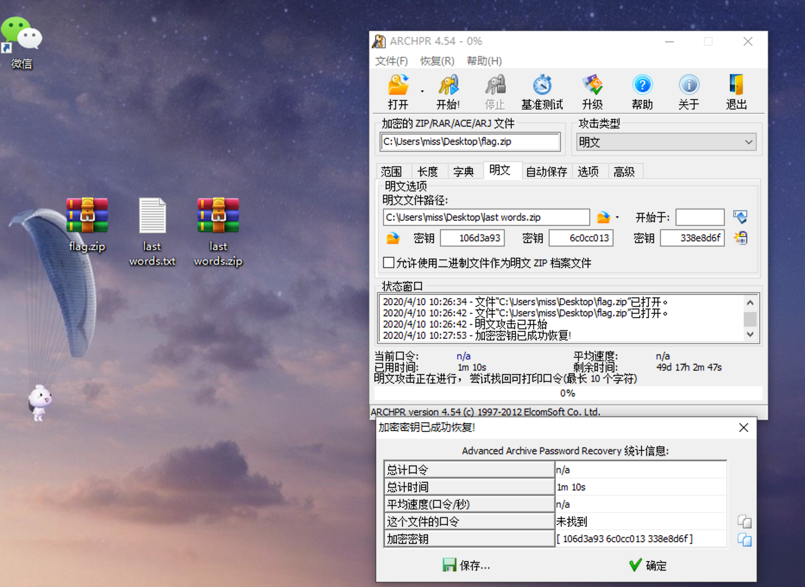

> 得到flag.png图片，查看是否进行了LSB隐写，得到flag：

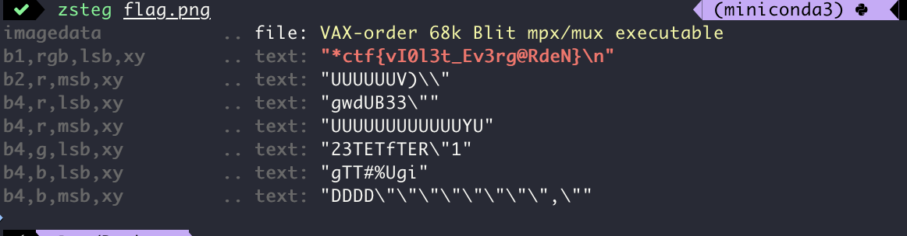

> ctf{vI0l3t_Ev3rg@RdeN}