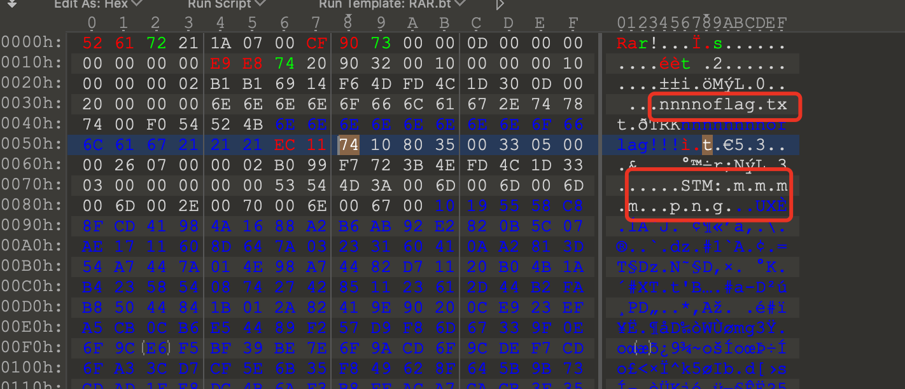
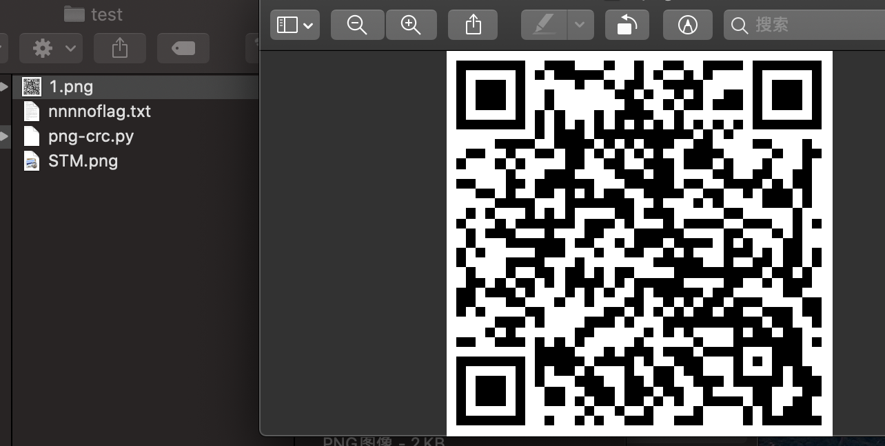

> 这是一道音频题目，打开是一个wav文件：music.wav。播放的时候就是kukukuku的声音，基本听不出啥来

> 使用Audacity打开进行分析，查看波形;如果低的波峰为0，高的波峰为1，那么可以组成0101001001100001011100100010000100011010 ...

> 这里波形太长了，使用脚本提取得到rar压缩包

```python
import wave as we
import numpy as np
 
wavfile =  we.open(u'music.wav',"rb")
params = wavfile.getparams()
framesra,frameswav= params[2],params[3]
datawav = wavfile.readframes(frameswav)
wavfile.close()
datause = np.fromstring(datawav,dtype = np.short)
 
result_bin=''
result_hex=''
max=0
for i in range(len(datause)-1):
    if datause[i]> max:
        max=datause[i]
    try:
        if(datause[i]<0 and datause[i+1]>=0):
            if (max-24000 >0):
                result_bin+='1'
                max=datause[i+1]
            else:
                result_bin+='0'
                max=datause[i+1]
    except:
        break
 
print result_bin    
for i in range(0,len(result_bin),4):
    result_hex+=hex(int(result_bin[i:i+4],2))[2:]
 
print result_hex
 
file_rar = open("test.rar","wb")
file_rar.write(result_hex.decode('hex'))  
file_rar.close()    
```

> 解压rar未得到flag，说明flag在其他地方隐藏，010 Editor打开发现有png。没有显示说明压缩包格式出了问题



> 修改块类型显示0x7A,这显然是不对的，改成0x74文件头，多了个STM，解压出来，添加后缀得到png图片


> 图片不能正常打开，显示CRC校验有问题，修复CRC得到完整二维码图片，扫描即可得到flag



> flag{4dcfda814ec9fd4761c1139fee3f65eb}