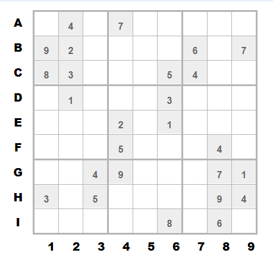

# 题目：Reverse4

### 题目描述：本题要求输入key字符串，正确弹出MessageBox，错误的key则不会弹出MessageBox。

### 题目难度： 🌟🌟 🌟🌟

### 维护：SiJiDo

### KEY: ``

### 配置信息： 

​	1.开放端口： `8080`

### 解题过程：

本题实现说明：本题中输入的key是9X9数独游戏（数独.png）的唯一解，此key会进行md5加密，得到的hash值会解密一段shellcode。错误的key则无法获得shellcode。此外，本题代码使用ollvm进行了混淆和膨胀。
思路：找到数独游戏图，然后得到唯一解。
正确的key：:u$YBPf2pa]Dt4#QM^H4ic'j0`w2y{d-Zzo2%/n_s@+2<UW)e4AR;F.4=-qEkvC2

